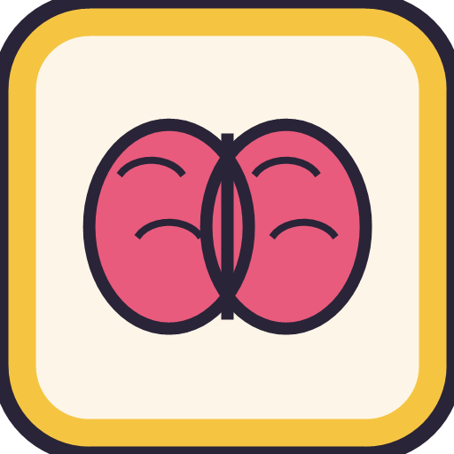

# BrainMaster

A Big Brain Academy-style brain training web app. 5 quick minigames, scored on speed and accuracy, with a final brain weight (in grams) and a letter grade.

## Play it

Open `index.html` in a browser. No build step. Works on desktop and mobile.

## The 5 games

| Category | Game | What you do |
|---|---|---|
| 🧠 THINK | Heaviest | Pick the expression with the largest value |
| ⚡ MEMORIZE | Flash | Numbered cells flash, then tap them 1 → N in order |
| 🔍 ANALYZE | Count | Count target shapes hidden among clutter |
| 🧮 COMPUTE | Math Sprint | Solve arithmetic with the on-screen keypad |
| 👁️ IDENTIFY | Shadow | Match the silhouette to an emoji |

Each game runs for 30 seconds. The final brain weight is the sum of per-game weights, mapped to a letter grade (S / A / B / C / D / E).

## Mobile

Installable as a PWA (manifest + icon included). Touch targets and layout adapt down to small phone widths.

## Tech

Vanilla JS, vanilla CSS, no build step, no dependencies. Fonts via Google Fonts CDN. State persists in `localStorage`.

## Files

- `index.html` — entry point
- `styles.css` — all styling, fully responsive
- `games.js` — the 5 minigame implementations
- `app.js` — home screen, test flow, results, persistence
- `manifest.json` — PWA manifest
- `icon.png` — app icon (512×512)
